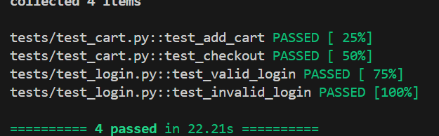

# QA Automation Task 


An automated test suite built with **Selenium WebDriver** and **Python** to validate the core functionality of [Saucedemo](https://www.saucedemo.com/) — a public demo e-commerce site commonly used for QA practice. This project was created as part of a QA Automation candidate task and follows industry-standard practices including the **Page Object Model (POM)** design pattern.

---

## Table of Contents

- [Test Cases](#-test-cases)
- [Framework & Tools](#-framework--tools)
- [Project Structure](#-project-structure)
- [Setup Instructions](#-setup-instructions)
- [How to Run the Tests](#-how-to-run-the-tests)
- [Test Results](#-test-results)
- [Test Credentials](#-test-credentials)

---

## Test Cases

| # | Test Case | Description | Status |
|---|-----------|-------------|--------|
| 1 | **Login Test** | Logs in with valid credentials (`standard_user`) and verifies successful redirect to the inventory page. | Pass |
| 2 | **Failed Login Test** | Attempts login with invalid credentials and verifies the correct error message is displayed. | Pass |
| 3 | **Add to Cart Test** | Logs in, adds the Sauce Labs Backpack to the cart, and verifies the cart badge shows the correct count. | Pass |
| 4 | **Checkout Test** | Logs in, adds a product to the cart, navigates to the cart, and proceeds to checkout — verifying the checkout page loads successfully. | Pass |

### Detailed Test Descriptions

#### 1. Login Test — `test_valid_login`
- Navigate to `https://www.saucedemo.com/`
- Enter valid username: `standard_user` and password: `secret_sauce`
- Click the **Login** button
- **Expected:** Current URL contains `inventory`, confirming redirect to the Products page

#### 2. Failed Login Test — `test_invalid_login`
- Navigate to `https://www.saucedemo.com/`
- Enter invalid credentials (`wrong` / `wrong`)
- Click the **Login** button
- **Expected:** Error message containing `"Username and password do not match"` is visible on the page

#### 3. Add to Cart Test — `test_add_cart`
- Log in with valid credentials
- Click **Add to cart** on the Sauce Labs Backpack product
- **Expected:** Cart icon badge updates to show `1`, confirming the item was added successfully

#### 4. Checkout Test — `test_checkout`
- Log in with valid credentials
- Add the Sauce Labs Backpack to the cart
- Click the cart icon to navigate to the cart page
- Click the **Checkout** button
- **Expected:** URL contains `checkout-step-one`, confirming the checkout flow has begun

---

## 🛠 Framework & Tools

| Tool | Version | Purpose |
|------|---------|---------|
| [Python](https://www.python.org/) | 3.8+ | Programming language |
| [Selenium WebDriver](https://www.selenium.dev/) | Latest | Browser automation |
| [PyTest](https://pytest.org/) | Latest | Test runner and assertions |
| [webdriver-manager](https://github.com/SergeyPirogov/webdriver_manager) | Latest | Automatic ChromeDriver management |
| Google Chrome | Latest | Browser under test |
| GitHub | — | Version control & code hosting |

**Why Selenium + PyTest?**

Selenium WebDriver is one of the most widely adopted browser automation tools in the industry, with extensive community support and compatibility across all major browsers. PyTest complements it perfectly with its clean fixture system, powerful assertion capabilities, and easy-to-read test syntax. Together they form a robust, beginner-friendly yet professional automation stack — well suited for validating web application functionality.

---

## Project Structure

```
qa-automation-task/
│
├── pages/                         # Page Object classes
│   ├── __init__.py
│   ├── login_page.py              # Login page actions & element selectors
│   └── inventory_page.py         # Inventory/cart page actions & selectors
│
├── tests/                         # Test files
│   ├── __init__.py
│   ├── test_login.py              # TC1 & TC2: Valid and invalid login tests
│   └── test_cart.py               # TC3 & TC4: Add to cart and checkout tests
│
├── conftest.py                    # Shared PyTest fixture — browser setup & teardown
├── pytest.ini                     # PyTest configuration (sets pythonpath)
├── requirements.txt               # All project dependencies
├── image.png                      # Test result screenshot
└── README.md                      # Project documentation
```

> This project follows the **Page Object Model (POM)** design pattern — separating page interactions from test logic to keep the code clean, reusable, and easy to maintain.

---

## Setup Instructions

### Prerequisites

Make sure you have the following installed before running the project:

- [Python](https://www.python.org/downloads/) v3.8 or higher
- pip (comes bundled with Python)
- Git
- Google Chrome (latest version)

### Installation

**1. Clone the repository**

```bash
git clone https://github.com/baniya777/QA-Automation-Task-.git
cd qa-automation-task
```

**2. Create and activate a virtual environment**

```bash
python -m venv venv
```

```bash
# Windows
venv\Scripts\activate

# macOS / Linux
source venv/bin/activate
```

**3. Install all dependencies**

```bash
pip install -r requirements.txt
```

> ChromeDriver is managed automatically by `webdriver-manager` — no manual driver download or PATH configuration needed.

---

## How to Run the Tests

### Run all tests

```bash
pytest -v
```

### Run a specific test file

```bash
pytest tests/test_login.py -v
pytest tests/test_cart.py -v
```

### Run a specific test by name

```bash
pytest tests/test_login.py::test_valid_login -v
pytest tests/test_login.py::test_invalid_login -v
pytest tests/test_cart.py::test_add_cart -v
pytest tests/test_cart.py::test_checkout -v
```

### Generate an HTML test report

```bash
pip install pytest-html
pytest -v --html=report.html
```

Then open `report.html` in your browser to view a detailed test report.

---

## Test Results

All 4 tests pass successfully. PyTest provides a clear summary in the terminal after each run, showing which tests passed, failed, or were skipped.

> A screenshot showing all tests passing is included in the repository as .

---

## Test Credentials

These are publicly available demo credentials provided by the Saucedemo site:

| Field | Value |
|-------|-------|
| Valid Username | `standard_user` |
| Valid Password | `secret_sauce` |
| Invalid Username | `wrong` |
| Invalid Password | `wrong` |
| Test URL | `https://www.saucedemo.com/` |

---

## Author

**Supriya Baniya** — [@baniya777](https://github.com/baniya777)

